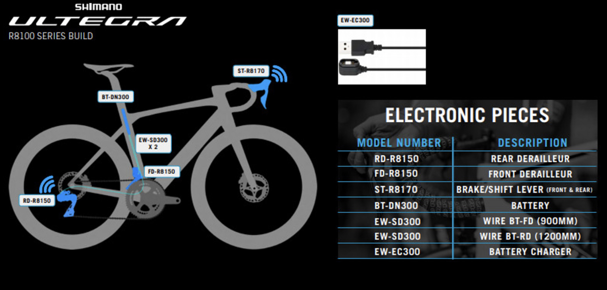

# Gravel Bike

## Model

* 2017 Niner RLT RDO
* 56cm

## Painting

### Painter and Costs

#### Nick

### Color Ideas

### Chain stay guard

https://www.ninerbikes.com/metal-parts-kit-rlt-9-rdo/

#### Sources

## Bars

* [Kitchen Sink](https://redshiftsports.com/products/kitchen-sink-handlebar)
* 

## Frame moounts

https://www.mcmaster.com/stainless-steel-rivet-nuts/

## Gearing

|Component Group|Speeds|Front|Rear|
|---            |---   |---  |--- |
|Shimano GRX|11|48/31T|11-34T|
|SRAM|12|43/30T|10-36T|
|Shimano Ultegra R8100|12|34/50T|11-34T|

## Component Upgrades

### Shimano GRX Di2 11 Speed

|Component|Size|Part|Name|Price|Available?|
|---      |--- |--- |--- |--- |---       |
|Brake/Shift Levers and Brakes|NA|ST-RX815-L/R|Shimano GRX - DI2 Set|$409 x 2| |
|Rotor: Front|160mm| | | | |
|Rotor: Rear|140mm| | | | |
|Front Derailleur|NA|FD-RX815-F|Shimano Di2 Front Derailleur 2x11-speed|$238| |
|Crankset|?mm|FC-RX810-2|Shimano GRX - Gravel Crankset - 48/31T - 170, 172.5, and 175mm|$234| |
|Bottom Bracket|PF30>24MM|SM-BB72-41|Shimano Ultegra Press Fit Bottom Bracket 86.5 mm shell width| | | |
|Rear Derailleur|NA|RD-RX815|Shimano GRX - Di2 - Rear Derailleur - 34T max low sprocket |$299| |
|Rear Derailleur|NA|RD-RX817|Shimano GRX - Di2 - Rear Derailleur - 42T max low sprocket |$334| |
|Cassette| |CS-HG800-11|Shimano - 11-34T|$72| |
|Chain| |CN-HG701-11|Shimano Steps E6000 Chain|$42|Y|
|Charger|NA|SM-BCR2|...|$135| |
|Battery|NA|BT-DN110-A|...|$145| |
|Junction|NA| | | | |
|Wires| | | | | |
|Wireless Unit|NA|EW-WU111|E-TUBE Wireless Unit D-FLY 2-Port Junction|$90| |

Total retail: $1,983 (not including rotors, bottom bracket, wireless module, cables, junctions)

Pros

* Better lever ergonomics than SRAM
* Faster shifting than SRAM
* Better braking modulation than SRAM
* Longer battery life

Cons

* Wired
* Requires separate module for mobile app connectivity
* Single battery in seat tube. Can't carry spares.

TBD

* Mobile app
* Drivetrain and shifting noise
* 11-speed vs SRAM 12-speed

### SRAM Force eTap AX Wide 12 Speed

|Component|Size|Part|Name|Price|Available?|
|---      |--- |--- |--- |--- |---       |
|Brake/Shift Levers and Brakes|NA|ED-FRC-D1|SRAM Force eTap AXS HRD Shift-Brake System|$332 x 2|[Wheel Works - Boston](https://www.wheelworks.com/product/sram-force-etap-axs-hrd-shift-brake-system-366227-1.htm?variations=920541,920550)  [Summit Bicycles](https://www.summitbicycles.com/product/sram-force-etap-axs-2x-electronic-hrd-groupset-380285-1.htm?variations=1243102&gclid=Cj0KCQiA3fiPBhCCARIsAFQ8QzWwk2qCYl4_HhjmTdXm-e_AXFCsPPNprl8_jsk9fTByFk0bDwFhgBAaAm3CEALw_wcB)|
| |NA| |SRAM Rival eTap AXS HRD Shift-Brake System|$199 x 2|[Kyle's Bikes](https://kylesbikes.com/sram-rival-etap-axs-hrd-shift-brake-lever-and-hydraulic-disc-caliper-710845864650.html)|
|Rotor: Front|160mm| | | | |
|Rotor: Rear|140mm| | | | |
|Front Derailleur|NA|FD-FRC-EW-D1|SRAM Force eTap Wide|$230| |
|Crankset|?mm|FC-FRC-W-D1|SRAM Force Wide 43/30T - 165mm, 167.5mm, 170mm, 172.5mm, 175mm, 177.5mm|$254| |
|Bottom Bracket|PF30>24MM| |DUB PF30 Bottom Bracket| | | |
|Rear Derailleur|NA|RD-FRC-E-D1|SRAM Force eTap Rear Derailleur|$357| |
|Cassette| |CS-XG-1270-D1|SRAM Force XG-1270 10-36|$185| |
|Chain| | |SRAM Force AXS 12-speed Flattop Chain|$35|Y|
|Charger|NA| |SRAM eTap Battery Charger|$46| |
|Batteries|NA| |SRAM AXS eTap Battery|$56 x 3| |

Total retail: $1,939 (not including rotors, bottom bracket)

Pros

* Gravel oriented
* Completely wireless
  * Bluetooth and mobile connectivity built in
* Ease of charging batteries
* Ability to carry spare batteries
* Wide gearing (need to confirm)
* Ease of removing rear derailleur for travel

Cons

* Not as fast shifting as Shimano GXR
  * Potential 2x issue with front derailleur
* Not as good braking modulation as Shimano GXR

TBD

* AXS app
* Drivetrain and shifting noise
* 11-speed vs SRAM 12-speed

### Shimano Ultegra R8160 Di2 12 Speed

Road. Not gravel-specific.

|Component|Size|Part|Name|Price|Available?|
|---      |--- |--- |--- |---  |---       |
|Brake/Shift Levers and Calipers|NA|ST-R8170-R/L|...|$536 x 2|N|
|Disc Brake Caliper| |BR-R8170|Included above|NA|N|
|Rotor Front|160mm|RT-MT800|...|$?|N|
|Rotor Rear|140mm|RT-MT800|...|$?|N|
|Front Derailleur|NA|FD-R8150|...|$259|N|
|Crankset|?mm|FC-R8100 Crankset|34x50 - ??mm|$314|N|
|Bottom Bracket|PF30>24MM| |...|$?|N|
|Rear Derailleur|NA|RD-R8150|...|$409|N|
|Cassette| |CS-R8100|11-34|$111|N|
|Chain| |CN-M8100|12-speed Chain|$46|Y|
|Charger Cable|NA|EW-FC300|Battery Charger Cable|$49|N|
|Battery|NA|BT-DN300|Internal Battery|$184|N|
|Wires|NA| |2 x E-Tube Wires|$?|N|

Total retail: $2,444 (not including rotors, bottom bracket, and wires)

Pros

* Wireless shifters

Cons

* ~$500 more expensive that SRAM Force and Shimano GRX Di2
* Not generally available until summer
* Wired derailleurs
* Battery not easy to remove to charge
* Can't carry spare battery

TBD

* Shift speed
* Comfort of levers

## Wheels

https://www.lightbicycle.com/700C-tubeless-bicycle-wheels-32mm-wide-40mm-deep-clincher-for-cyclocross-road-and-gravel-bikes.html

## Tires

### Gravel

40cm?

### Road

32cm
