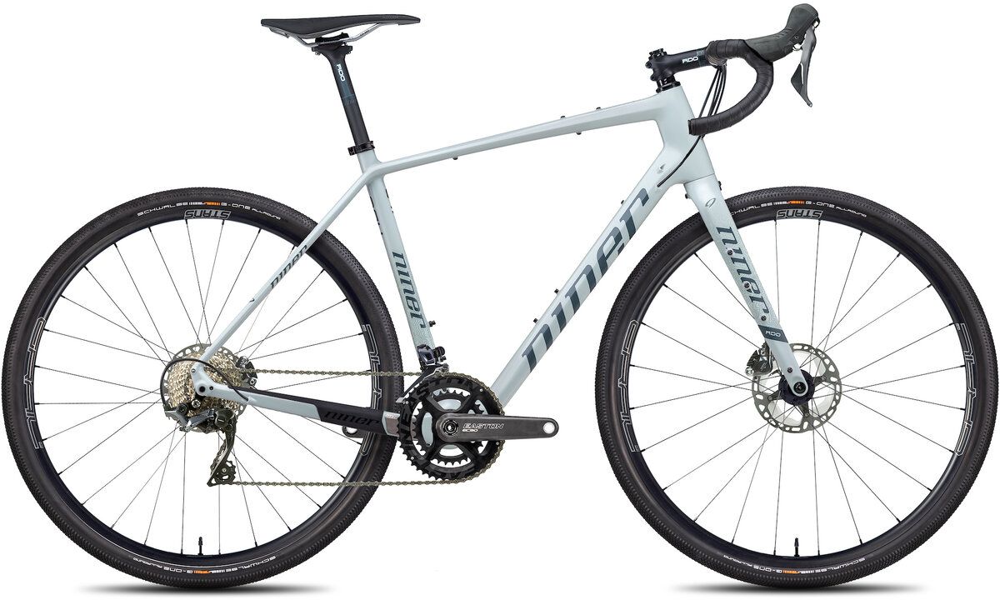
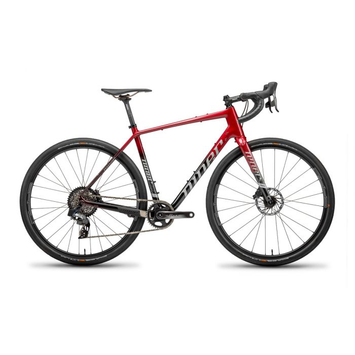
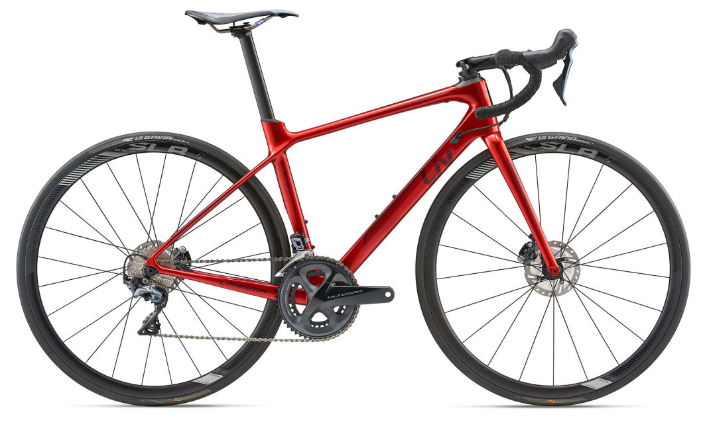

# Gravel Bike

## Model

* 2017 Niner RLT RDO
* 56cm

## Painting

### Painter and Costs

#### Nick

### Color Ideas

 

### Chain stay guard

https://www.ninerbikes.com/metal-parts-kit-rlt-9-rdo/

#### Sources

## Bars

* [Kitchen Sink](https://redshiftsports.com/products/kitchen-sink-handlebar)
* 

## Frame moounts

https://www.mcmaster.com/stainless-steel-rivet-nuts/

## Component Upgrades

### Shimano GRX Di2

### SRAM Force eTap AXS

#### Gearing

#### Components

DUB or GXP crank?

|Component|Size|Part|Name|Price|Available?|
|---      |--- |--- |--- |--- |---       |
|Brake/Shift Levers and Brakes|NA|ED-FRC-D1|SRAM Force eTap AXS HRD Shift-Brake System|$332| |
|Front Derailleur|NA|FD-FRC-EW-D1|SRAM Force eTap Wide|$230| |
|Crankset|?mm arm lenght|FC-FRC-W-D1|SRAM Force Wide 43/30T - 165mm, 167.5mm, 170mm, 172.5mm, 175mm, 177.5mm|$254| |
|Bottom Bracket|PF30>24MM| |DUB PF30 Bottom Bracket| | | |
|Rear Derailleur|NA|RD-FRC-E-D1|SRAM Force eTap Rear Derailleur|$357| |
|Cassette| |CS-XG-1270-D1|SRAM Force XG-1270 10-36|$185| |
|Chain| | |SRAM Force AXS 12-speed Flattop Chain|$35|Y|
|Charger|NA| |SRAM eTap Battery Charger|$46| |
|Batteries|NA| |SRAM AXS eTap Battery|$56x2| |

Total retail: $1,551 (not including bottom bracket)

## Wheels

https://www.lightbicycle.com/700C-tubeless-bicycle-wheels-32mm-wide-40mm-deep-clincher-for-cyclocross-road-and-gravel-bikes.html

## Tires

### Gravel

40cm?

### Road

32cm
