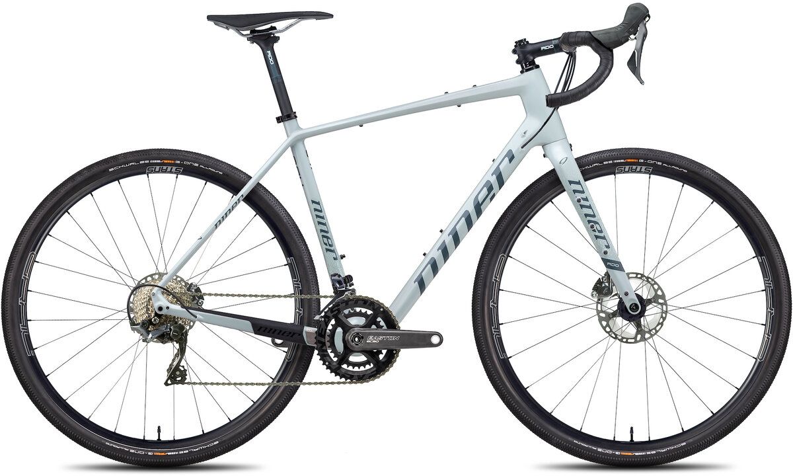
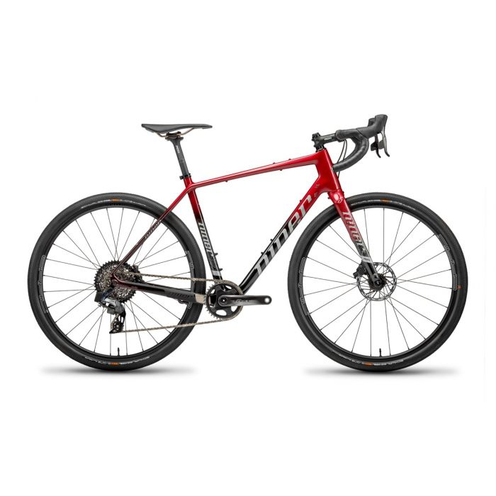
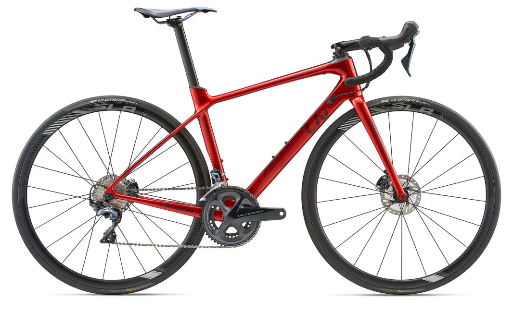

# Gravel Bike

## Model

* 2017 Niner RLT RDO
* 56cm

## Painting

### Painter and Costs

#### Nick

### Color Ideas

*  
* 
* 

### Chain stay guard

https://www.ninerbikes.com/metal-parts-kit-rlt-9-rdo/

#### Sources

## Bars

* [Kitchen Sink](https://redshiftsports.com/products/kitchen-sink-handlebar)
* 

## Frame moounts

https://www.mcmaster.com/stainless-steel-rivet-nuts/

## Component Upgrades

### Shimano GRX Di2

### SRAM Force eTap AXS

|Compoin

* Crank: SRAM FORCE 43/30 WIDE CRANKSET

## Wheel Upgrades

https://www.lightbicycle.com/700C-tubeless-bicycle-wheels-32mm-wide-40mm-deep-clincher-for-cyclocross-road-and-gravel-bikes.html

## Tires

### Wide

### Skinny
